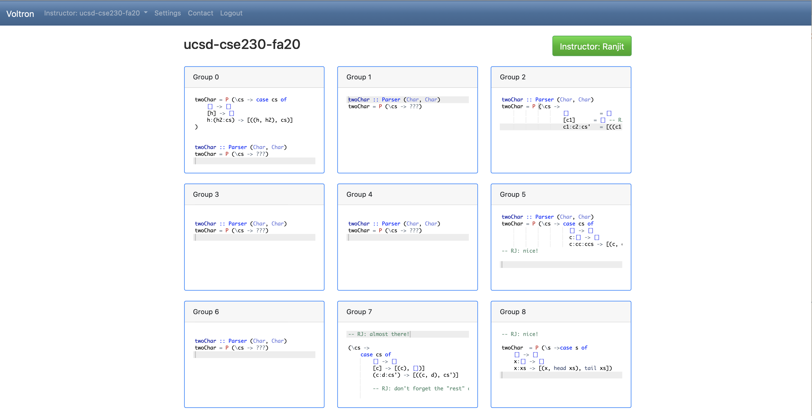

# Voltron


Voltron is a web-app that allows *instructors* to simultaneously view the progress of multiple *groups* 
of students *collaborating* on *in-class* programming exercises.

## Instructor

The instructor views *all* the student buffers (as they are being edited)



## Student

All the students in a single group see their (shared) buffer, in which they 
can collaborate on the in-class exercise.


## Running 

```
$ build.sh
$ run.sh
```

To change the port at which the server runs,

```
$ ./voltron --static=static --port=8091 -h 0.0.0.0
```

To add an **instructor** to the DB

```
$ ./voltron add-user --email=rjhala@eng.ucsd.edu --password=rjhala --firstname=Ranjit --lastname=Jhala
```

To add a **class** to the DB 

```
./voltron add-class --institution=UCSD  --classname=CSE230 --instructor=rjhala@eng.ucsd.edu --language=haskell
```

The instructor can then log in and **enroll students** by uploading a [CSV file](/server/tests/enroll-230.csv) with the following format

```csv
Email, FirstName, LastName, Group
rjhala@eng.ucsd.edu, Ranjit, Jhala, 0
wkunkel@eng.ucsd.edu, Rose, Kunkel, 1
nilehmann@eng.ucsd.edu, Nico, Lehmann, 1
nadia@eng.ucsd.edu, Nadia, Polikarpova, 2
deian@eng.ucsd.edu, Deian, Stefan, 2
```

## DEVELOP 

Frontend

```sh
$ cd client
$ yarn install
$ yarn serve
```

## Firebase

Here's the link to get access to the firebase stuff

https://console.firebase.google.com/project/voltron-8ba6b/database/voltron-8ba6b/data
