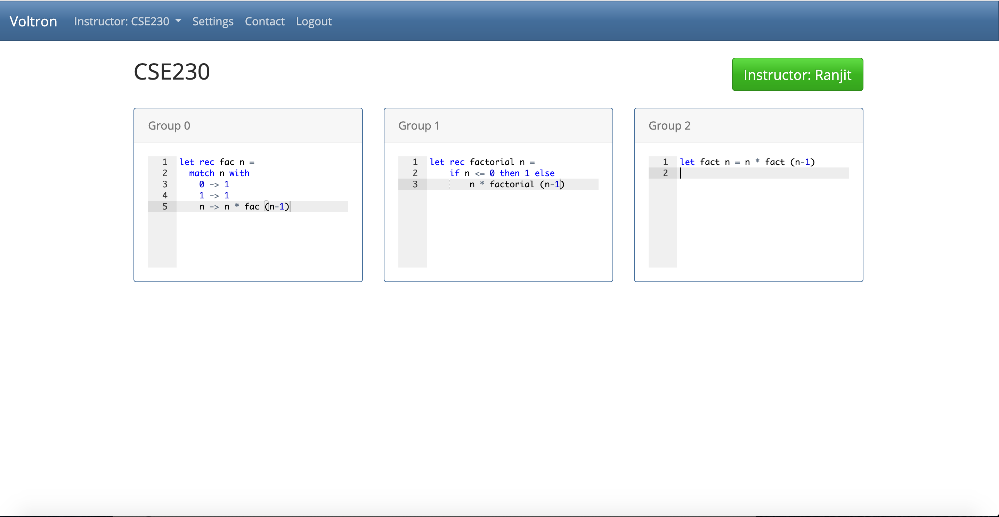

# Voltron

Voltron is a web-app that allows *instructors* to simultaneously view the progress of multiple *groups* 
of students *collaborating* on *in-class* programming exercises.



## INSTALL

Frontend

```sh
$ cd client
$ yarn install
$ yarn serve
```

